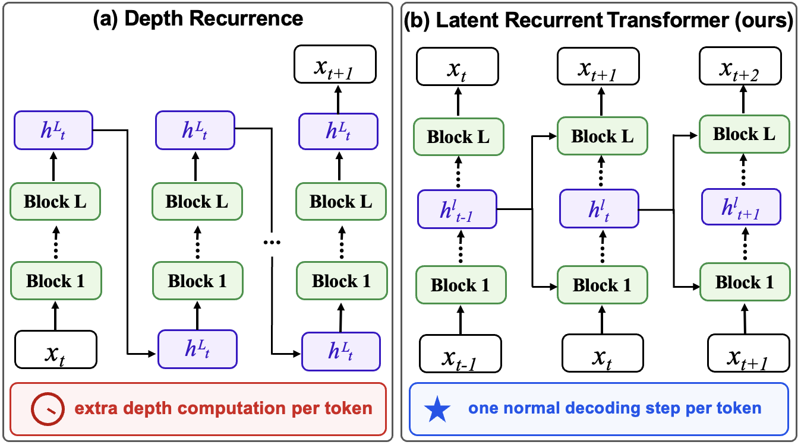
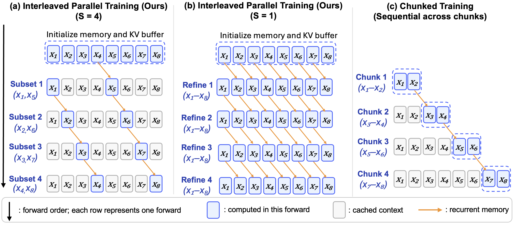

# Latent Recurrent Transformer (LRT)

<h3 align="center">
  Official code for the EMNLP 2026 paper
  <a href="https://arxiv.org/abs/2605.26797">Latent Recurrent Transformer: Architecture Exploration, Training Strategies, and Scaling Behavior</a>
</h3>

<p align="center">
  
</p>

LRT reuses the high-level hidden state that the model already computed for token `t-1` as **recurrent memory** when processing token `t`. This adds a cross-token, cross-layer latent pathway while keeping the standard attention mechanism, the KV-cache interface, and **one model forward per generated token** — unlike depth-recurrent methods, which spend extra computation on every token.

The catch is pretraining: the recurrence `m_1 → m_2 → … → m_T` would naively require unrolling the Transformer token by token. This repo implements the two parallel training schedules from the paper that avoid that:

- **Multi-refinement training** (`--multi-refine`) — the paper's *full-sequence refinement*. One full-sequence initialization forward, then `K` more **full** forwards, each fed by the hidden states of the previous one. ~(K+1)× the token compute of a standard update; a simple knob for trading extra training compute for quality, with no change to decoding.
- **Interleaved training** (`--interleaved`) — the paper's default, *interleaved parallel training*. One full-sequence initialization forward, then `S` cheap partial forwards over disjoint interleaved position subsets. ~2× token compute.

Both schedules train the *same* architecture and produce models that decode the same way: token by token, with true recurrence, one forward per token.

The codebase is a fork of [karpathy/nanochat](https://github.com/karpathy/nanochat), keeping its minimal single-node training harness (tokenizer, pretraining, BPB/CORE evaluation) and adding LRT on top.

## Method

### Architecture

At position `t`, every layer receives the recurrent memory `m_{t-1}` — the previous position's hidden state (shifted right by one, so causality is preserved; the first position gets zeros). It is injected two ways:

1. **Residual Injection** — added to the residual stream with a learned per-layer scale γ (init 0.1): `x̄ = α·x + γ·m_{t-1}`.
2. **KV Projection** — projected into the layer's key and value spaces by per-layer linear maps and mixed with the local K/V through input-dependent per-head gates (init to the neutral value 1). nanochat's token-indexed value embeddings are gated alongside the recurrent values.

The combined key goes through the usual QK-norm + RoPE pipeline, so the KV cache keeps its standard shape; decoding stores just one extra `d`-dimensional state per sequence.

> This release implements the **LRT-layerwise** variant (separate recurrent K/V projections per layer) and uses the final-layer hidden state (`h_final`) as the memory source, instead of searching for the best source layer.

### Training schedules

<p align="center">
  
</p>

Each row is one forward; blue boxes are positions computed in that forward, gray boxes are cached context, and orange arrows are recurrent memory. **(a)** Interleaved training, shown with `S = 4` subsets. **(b)** Multi-refinement training, shown with `K = 4` refinement forwards — the paper treats it as the `S = 1` case of the same formulation, where the single subset is the whole sequence. **(c)** The chunked-training baseline, which only passes memory across chunk boundaries.

### Multi-refinement training (`--multi-refine`)

Every forward covers the **whole** sequence.

- **`refine0`** (initialization): a normal parallel forward over all positions with zero memory.
- **`refine k`, for `k = 1..K`**: another full forward, fed `shift_right(hidden states of refine k-1)`. All positions update synchronously, so information travels along the diagonal — position `t` at forward `k` sees position `t-1` at forward `k-1`.
- The loss is the (optionally weighted) mean over all `K+1` forwards, backpropagated jointly through all of them (`--multi-refine-detach` cuts the cross-forward gradient). Cost and activation memory scale with `K+1`.

Additional refinement forwards give consistent but diminishing gains that saturate around `K = 3`. Up-weighting later forwards (e.g. `--multi-refine-loss-weights 0.1,0.3,0.6` for `K = 2`) helps further.

### Interleaved training (`--interleaved`)

A sparse version of the same idea: the refinement work is split across `S` disjoint position subsets, so the sequence is recomputed only once.

- **Initialization forward**: a normal parallel forward over all positions with zero memory. Every layer's K,V and the hidden states are captured into a sequence-level buffer.
- **Interleaved subset forwards**: the `i`-th one (`i = 0..S-1`) recomputes only the positions with `pos % S == i`, reading the buffer and using the *latest* hidden states as recurrent memory. Its fresh K,V and hidden states are written back, so later subsets consume memory already refined by earlier ones.
- Together the `S` subset forwards recompute the sequence once, so a step costs ~2 full forwards. The loss is the mean of the initialization loss and the `S` subset losses, backpropagated jointly (gradients flow through the buffer).
- Optionally (`--interleaved-kv-refresh`), between subset forwards the buffered K/V at not-yet-visited positions are cheaply re-projected from the latest hidden states to reduce staleness.

This matches multi-refinement training with `K = 1` in compute (~2×). In the paper the two are on par from moderate data budgets onward, with interleaved training slightly better in the low-data regime.

### Inference

The model decodes token by token with *true* recurrence: each position's hidden state is the next position's memory. Refinement forwards exist only at training time. `evaluate_bpb_sequential` measures exactly this decoding-time quality (the paper's "Decoding" column).

## Results

20-layer (~1.3B) model, `R = 10` tokens per parameter, validation BPB (lower is better):

| Method | Forwards / generated token | BPB |
|--------|:--:|:--:|
| Transformer baseline | 1 | 0.767 |
| Loop Transformer (2 loops) | 2 | 0.753 |
| Loop Transformer (3 loops) | 3 | **0.749** |
| PonderLM-2 (1 thought) | 2 | 0.753 |
| **LRT, multi-refinement training (`K = 3`)** | **1** | **0.749** |
| **LRT, interleaved training (`S = 2`)** | **1** | 0.752 |

Across 1.3B and 2.1B backbones and a wide range of training budgets, LRT improves both BPB and CORE over the Transformer baseline at matched training compute, with ~9% decoding latency overhead. See the paper for full scaling curves and ablations.

## Quick start

Environment setup follows nanochat (uv + PyTorch; see [runs/speedrun.sh](runs/speedrun.sh) for a reference setup). Then:

```bash
# 1. Download pretraining data (FineWeb-Edu, used for all results in the paper)
python -m nanochat.dataset -d fineweb -n 240

# 2. Train the tokenizer (or reuse an existing one)
python -m scripts.tok_train --dataset fineweb

# 3a. Pretrain with multi-refinement training, K=2 (8 GPUs; drop torchrun for single GPU).
#     1 initialization forward + 2 refinement forwards; activation memory scales with K+1,
#     so consider a smaller --device-batch-size
OMP_NUM_THREADS=1 torchrun --standalone --nproc_per_node=8 -m scripts.base_train -- \
    --depth=12 \
    --run=d12-multi-refine \
    --multi-refine \
    --multi-refine-passes=2 \
    --device-batch-size=2

# 3b. Or: interleaved training, S=2
OMP_NUM_THREADS=1 torchrun --standalone --nproc_per_node=8 -m scripts.base_train -- \
    --depth=12 \
    --run=d12-interleaved \
    --interleaved \
    --interleaved-passes=2 \
    --device-batch-size=4

# Baseline for comparison: the same command without --multi-refine / --interleaved
```

Evaluate a trained model:

```bash
# Parallel BPB (per-forward breakdown), CORE, and samples
torchrun --standalone --nproc_per_node=8 -m scripts.base_eval -- --eval core,bpb

# Sequential (true recurrent decoding) BPB — multi-refine and interleaved models
torchrun --standalone --nproc_per_node=8 -m scripts.base_eval -- --eval bpb_seq
```

## Key CLI flags (`scripts.base_train`)

| Flag | Default | Description |
|------|---------|-------------|
| `--multi-refine` | off | Enable multi-refinement training (1 initialization forward + `K` full refinement forwards) |
| `--multi-refine-passes` | 2 | Number of full refinement forwards `K` after the initialization forward (total forwards per step = `K+1`) |
| `--multi-refine-loss-weights` | equal | Comma-separated per-forward loss weights of length `K+1`, e.g. `0.1,0.3,0.6` |
| `--multi-refine-detach` | off | Detach hidden states between forwards (no gradient flow from later forwards into earlier ones) |
| `--interleaved` | off | Enable interleaved training (1 initialization forward + `S` interleaved subset forwards; mutually exclusive with `--multi-refine`) |
| `--interleaved-passes` | 2 | Number of interleaved subsets `S`; subset forward `i` covers positions `pos % S == i` |
| `--interleaved-kv-refresh` | off | Cheaply refresh buffered K/V at unvisited positions between subset forwards |
| `--compile-interleaved` | off | Also `torch.compile` the interleaved subset forward (runs eagerly by default) |
| `--eval-seq-every` | 250 | Run sequential (recurrent decoding) BPB eval every N steps (LRT models only) |
| `--eval-seq-batch-size` | 128 | Batch size for sequential eval (limited by KV cache memory) |
| `--eval-seq-full-pass-sanity` | off | Also run a zero-memory token-by-token eval; should match the parallel initialization-forward BPB |
| `--dataset` | fineweb | Pretraining dataset: `fineweb` or `climbmix` |
| `--ve-gate-channels` | 0 (full model dim) | Input channels for the K/V gates; set e.g. 32 to gate from a channel slice |
| `--no-value-embeds` / `--ve-every-layer` / `--no-x0-residual` / `--no-resid-lambdas` | — | Ablation toggles for the baseline architecture |

Setting `NANOCHAT_INTERLEAVED_FLEX=1` enables a FlexAttention fast path for interleaved subset attention (falls back to SDPA on failure).

## Evaluation modes

- **Parallel BPB** (`evaluate_bpb`): runs the training-time pipeline and reports BPB per forward plus a headline number.
  - Multi-refine models: `refine0`, `refine1`, …, all scored at all positions (`refine0` is the zero-memory initialization forward). Nothing needs merging, so the headline is simply the **final forward**.
  - Interleaved models: `full`, `interleaved1`, …, each subset scored at its own positions. The headline is the **merged** BPB — each position scored by the last forward that computed it.
- **Sequential BPB** (`evaluate_bpb_sequential`): token-by-token decoding with true recurrence, including a per-position-bucket breakdown. A `full_pass_sanity` mode (zero memory throughout) should reproduce the parallel initialization-forward BPB, verifying that the KV-cached decoding path matches the parallel training path.
- **CORE** (`scripts.base_eval --eval core`): the DCLM CORE metric, evaluated with zero-memory (initialization-forward) semantics.
- **Diagnostics**: at each eval, training prints the learned per-layer scales (α residual, β x0, γ memory) and the average gate values (`gate_local` / `gate_fb` / `gate_ve`) per layer.

## Citation

```bibtex
@article{huang2026lrt,
  title         = {Latent Recurrent Transformer: Architecture Exploration, Training Strategies, and Scaling Behavior},
  author        = {Huang, Zeyi and He, Xuehai and Ren, Liliang and Wang, Yiping and Peng, Baolin and Cheng, Hao and Wang, Shuohang and He, Pengcheng and Gao, Jianfeng and Lee, Yong Jae and Shen, Yelong},
  journal       = {arXiv preprint arXiv:2605.26797},
  year          = {2026}
}
```

## Acknowledgements

Built on [nanochat](https://github.com/karpathy/nanochat) by Andrej Karpathy (MIT license) — the training harness, tokenizer, data pipeline, optimizer, and evaluation framework all come from upstream.

```bibtex
@misc{nanochat,
  author = {Andrej Karpathy},
  title = {nanochat: The best ChatGPT that \$100 can buy},
  year = {2025},
  publisher = {GitHub},
  url = {https://github.com/karpathy/nanochat}
}
```

## License

MIT
